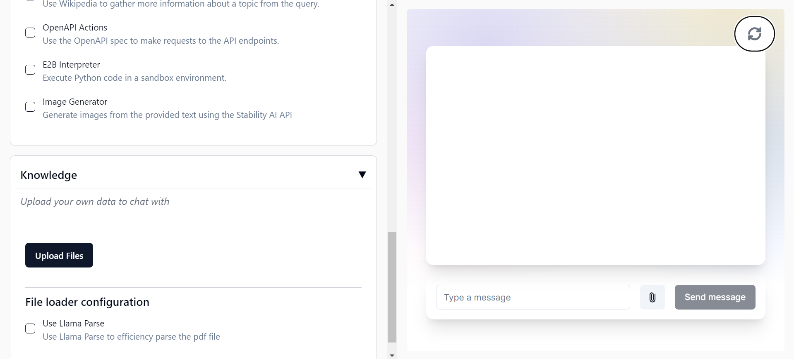
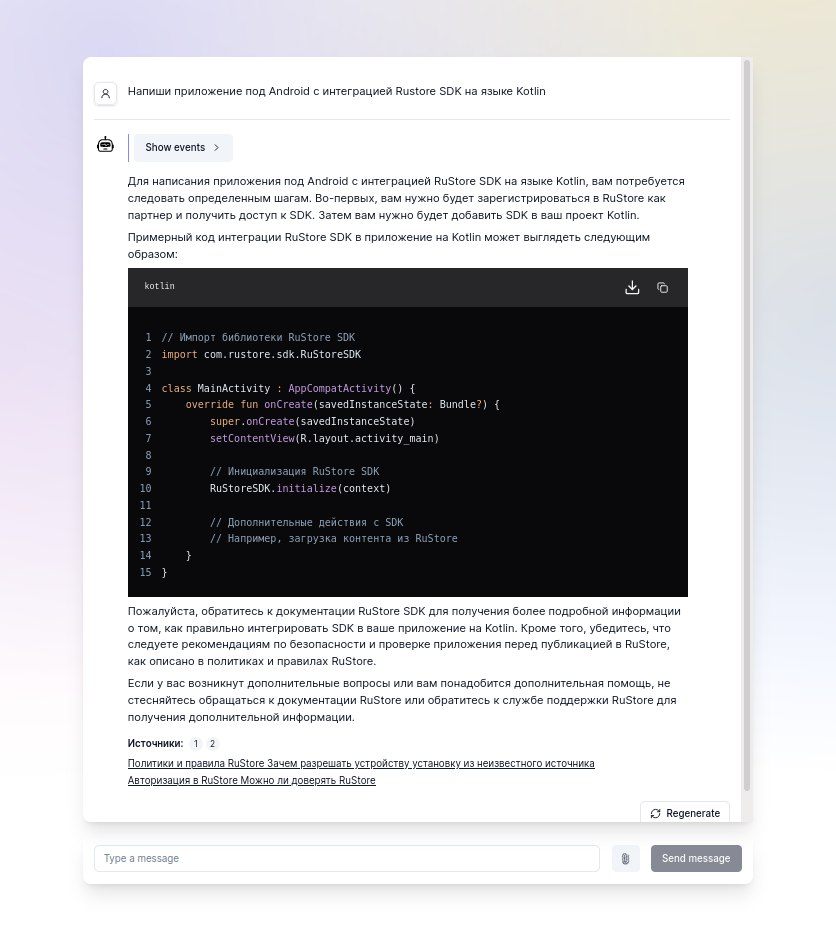
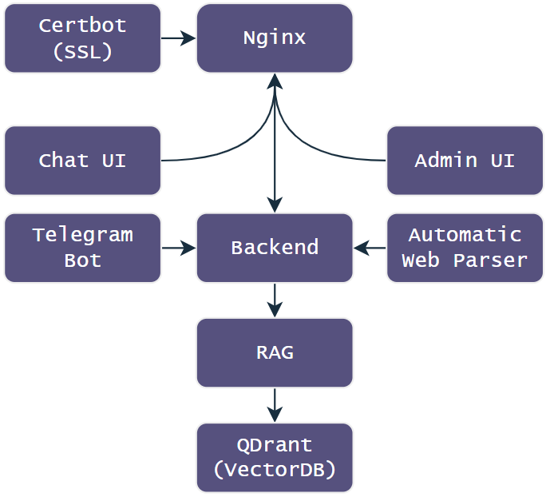

Based on [RAGapp](https://github.com/ragapp/ragapp) and [FastAPI Template](https://github.com/idashevskii/fastapi-postgres-template)

## Local Development

Copy file `.env.example` to `.env` and adjust configuration.

Run:

```bash
docker compose up -d --build
```

## Deploy to Production

Generate DH params

```sh
openssl dhparam -out ./services/reverse-proxy/ssl/dh-params.pem 2048
```

Generate Self signed cert

```sh
openssl req -x509 -nodes -days 3650 -newkey rsa:2048 -keyout ./services/reverse-proxy/ssl/self-signed/key.pem -out ./services/reverse-proxy/ssl/self-signed/cert.pem
```

Copy file `.env.example` to `.env` and adjust configuration.

Run services in prod mode:

```bash
./bin/prod-run.sh
```

---
## Прозрачность решения
https://github.com/bukhanka/cp-24-skfo-gen_ans_eval
---
## Automatic Parser
Реализована возможность автоматического парсинга официальной документации.
Принцип, схема и код находятся в репозитории ниже.

Репозиторий: https://github.com/Nizier193/cp-24-skfo-parser

---
## TgBot
Помимо веб-интерфейса, реализован телеграм бот, к которому может получить доступ человек, обладающий Telegram всего за несколько шагов.
Реализация на PytelegrambotApi. Код, схема и прочее прописаны в репозитории ниже.

Демо: https://t.me/rustore_manager_bot

Репозиторий: https://github.com/Nizier193/cp-24-skfo-tg-bot

---
## Admin Page
Реализована админ-панель, с помощью которой конфигурируется поведение системы.

Можно изменять такие параметры, как:
* Модель
* Системный промпт
* Агенты
* Наводящие вопросы
* Документы системы

Демо: https://cp-24-skfo.open-core.ru/admin



---

## User Page
Демо: https://cp-24-skfo.open-core.ru/ui



---

## Architecture


